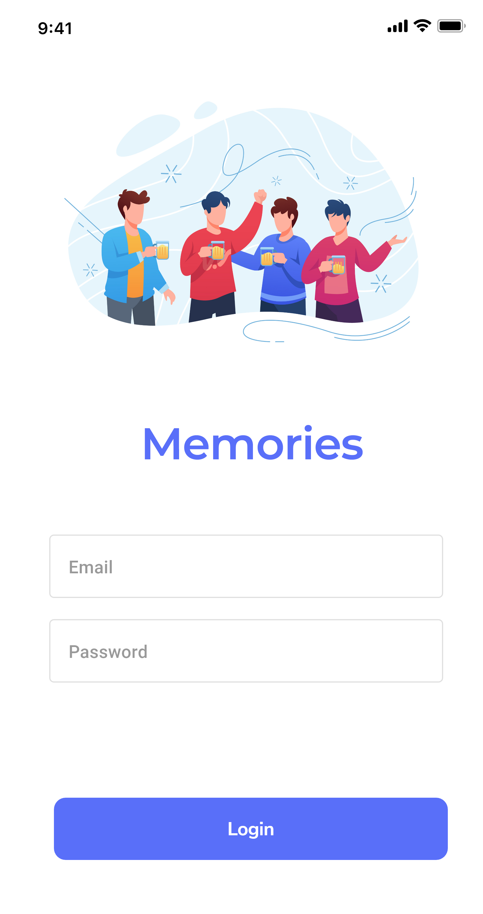
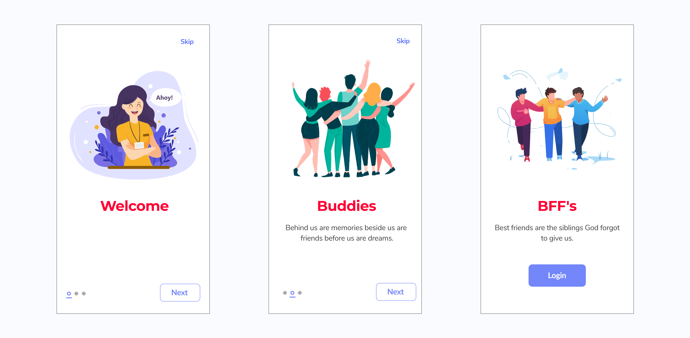

 
<h2 align="center"><b>Memories</b></h2>
<h4 align="center">A personal app for sharing college memories for Android.</h4>

## Screenshots

## Description

A personal app for my college group in which they can view each other's profiles and add or download each other's photos and videos. All images and videos are saved in firebase storage.

## Features

* Add photos and videos
* Only authenticated users use this app
* See all users available on the app
* See photos uploaded by other users
* Download photos
* Download videos